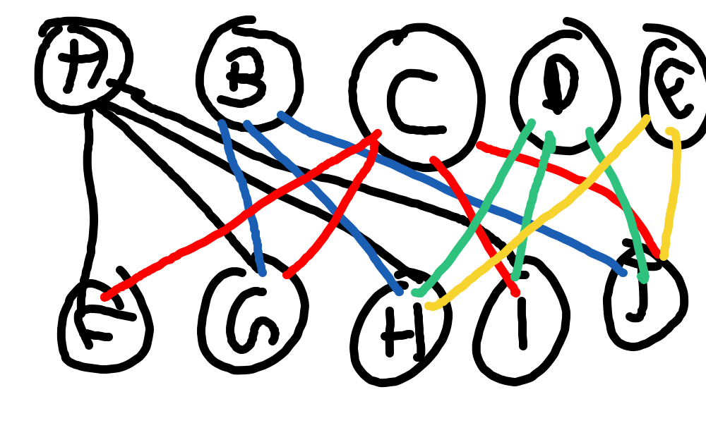
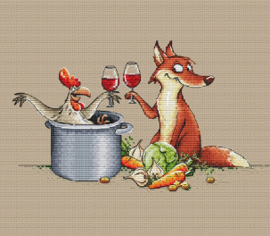

# ROBOT-CROSSING-THREE-CONTAINER-PROBLEM-FOX-CHICKEN-CHICK-FEED


This project implements a solution to the classic **Robot Crossing Problem**, where a robot needs to transport three items across a river:
- Fox  
- Chicken  
- Chicken Feed  

The challenge is to move all items across the river safely while following these rules:
1. The Fox cannot be left alone with the Chicken (the Fox will eat the Chicken).
2. The Chicken cannot be left alone with the Feed (the Chicken will eat the Feed).
3. The Robot can only carry one item at a time when crossing the river.

---

## State Diagram
The following diagram illustrates valid state transitions for this problem:



---

## Illustration
An illustrative image representing the Fox and Chicken problem:



---

## Solution Explanation
We represent each state as `(Robot, Fox, Chicken, Feed)`, where:
- `0` means the entity is on the starting side of the river.
- `1` means the entity is on the destination side of the river.

### Valid Path from `0000` to `1111`
1. Start at `0000` (all on the starting side). Robot takes the Chicken across: `0110`.
2. Robot returns alone: `0010`.
3. Robot takes the Fox across: `1010`.
4. Robot brings the Chicken back: `1000`.
5. Robot takes the Feed across: `1101`.
6. Robot returns alone: `0101`.
7. Robot takes the Chicken across: `1111`.

Final state `1111` means all items have safely crossed the river without breaking any rules.

---

## How to Run
```bash
# Clone the repository
git clone https://github.com/<your-username>/ROBOT-CROSSING-THREE-CONTAINER-PROBLEM.git

# Navigate to the project folder
cd ROBOT-CROSSING-THREE-CONTAINER-PROBLEM

# Run the Python script
python3 robot_crossing.py
